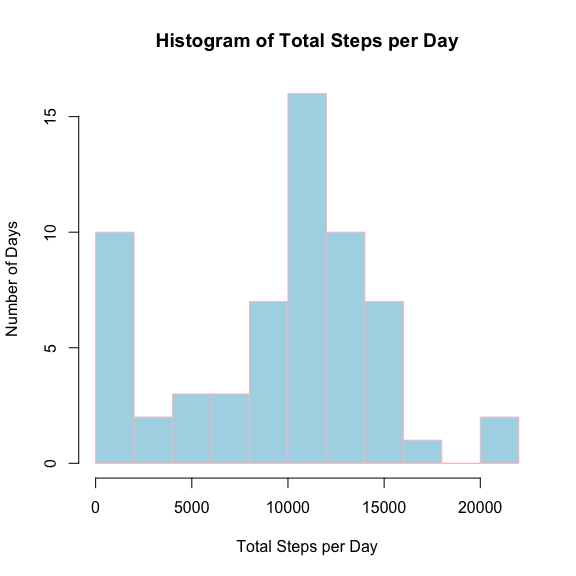
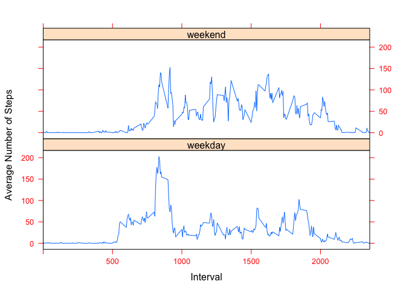

# Reproducible Research Peer Assessment 1 for Data Science Track (JHS)
Cos D. Fi  
September 2014  


## Open this file in GitHub for Mac or Windows

#### Loading and preprocessing the data

```r
setwd("~/Desktop/MOOCs/Coursera/DataScience/ReproducibleDataAnalysis_Course")

X <- read.csv("activity.csv", header=TRUE, na.strings = "", colClasses="character")
names(X)
```

```
## [1] "steps"    "date"     "interval"
```

```r
#Recode the variables
X$steps <- as.numeric(X$steps)
```

```
## Warning: NAs introduced by coercion
```

```r
X$date <- as.Date(X$date, format="%Y-%m-%d")
X$interval <- as.numeric(X$interval)
#The following are used to surpress printing of additional review of the data
#str(X)
#summary(X)
#summary(X$interval)
#X$interval <- format(X$interval, width = 4, format = "d", flag = "0")
#summary(X$interval)
#X$interval = as.factor(X$interval)
#summary(X$interval)
```
#### What is mean and median number of steps taken per day?

```r
library(plyr)
totalStepsDay <- na.omit(ddply(X, "date", summarise, TotalSteps = sum(steps, na.rm=TRUE)))
#totalStepsDay
```
#### Histogram of Total Steps per Day (original data)

```r
hist(totalStepsDay$TotalSteps, breaks = 10, main = ("Histogram of Total Steps per Day"), xlab = "Total Steps per Day", ylab = "Number of Days", col = "lightblue", border = "pink")
```

 

#### Mean Steps per Day

```r
meanStepsDay <- na.omit(ddply(X, "date", summarise, MeanSteps = mean(steps, na.rm=TRUE)))
meanStepsDay #Note that some days do not have numeric averages since data for those days are missing
```

```
##          date MeanSteps
## 2  2012-10-02    0.4375
## 3  2012-10-03   39.4167
## 4  2012-10-04   42.0694
## 5  2012-10-05   46.1597
## 6  2012-10-06   53.5417
## 7  2012-10-07   38.2465
## 9  2012-10-09   44.4826
## 10 2012-10-10   34.3750
## 11 2012-10-11   35.7778
## 12 2012-10-12   60.3542
## 13 2012-10-13   43.1458
## 14 2012-10-14   52.4236
## 15 2012-10-15   35.2049
## 16 2012-10-16   52.3750
## 17 2012-10-17   46.7083
## 18 2012-10-18   34.9167
## 19 2012-10-19   41.0729
## 20 2012-10-20   36.0938
## 21 2012-10-21   30.6285
## 22 2012-10-22   46.7361
## 23 2012-10-23   30.9653
## 24 2012-10-24   29.0104
## 25 2012-10-25    8.6528
## 26 2012-10-26   23.5347
## 27 2012-10-27   35.1354
## 28 2012-10-28   39.7847
## 29 2012-10-29   17.4236
## 30 2012-10-30   34.0938
## 31 2012-10-31   53.5208
## 33 2012-11-02   36.8056
## 34 2012-11-03   36.7049
## 36 2012-11-05   36.2465
## 37 2012-11-06   28.9375
## 38 2012-11-07   44.7326
## 39 2012-11-08   11.1771
## 42 2012-11-11   43.7778
## 43 2012-11-12   37.3785
## 44 2012-11-13   25.4722
## 46 2012-11-15    0.1424
## 47 2012-11-16   18.8924
## 48 2012-11-17   49.7882
## 49 2012-11-18   52.4653
## 50 2012-11-19   30.6979
## 51 2012-11-20   15.5278
## 52 2012-11-21   44.3993
## 53 2012-11-22   70.9271
## 54 2012-11-23   73.5903
## 55 2012-11-24   50.2708
## 56 2012-11-25   41.0903
## 57 2012-11-26   38.7569
## 58 2012-11-27   47.3819
## 59 2012-11-28   35.3576
## 60 2012-11-29   24.4688
```
#### Median Steps per Day

```r
medianStepsDay <- na.omit(ddply(X, "date", summarise, MedianSteps = quantile(steps, probs = 0.5, na.rm=TRUE)))
medianStepsDay
```

```
##          date MedianSteps
## 2  2012-10-02           0
## 3  2012-10-03           0
## 4  2012-10-04           0
## 5  2012-10-05           0
## 6  2012-10-06           0
## 7  2012-10-07           0
## 9  2012-10-09           0
## 10 2012-10-10           0
## 11 2012-10-11           0
## 12 2012-10-12           0
## 13 2012-10-13           0
## 14 2012-10-14           0
## 15 2012-10-15           0
## 16 2012-10-16           0
## 17 2012-10-17           0
## 18 2012-10-18           0
## 19 2012-10-19           0
## 20 2012-10-20           0
## 21 2012-10-21           0
## 22 2012-10-22           0
## 23 2012-10-23           0
## 24 2012-10-24           0
## 25 2012-10-25           0
## 26 2012-10-26           0
## 27 2012-10-27           0
## 28 2012-10-28           0
## 29 2012-10-29           0
## 30 2012-10-30           0
## 31 2012-10-31           0
## 33 2012-11-02           0
## 34 2012-11-03           0
## 36 2012-11-05           0
## 37 2012-11-06           0
## 38 2012-11-07           0
## 39 2012-11-08           0
## 42 2012-11-11           0
## 43 2012-11-12           0
## 44 2012-11-13           0
## 46 2012-11-15           0
## 47 2012-11-16           0
## 48 2012-11-17           0
## 49 2012-11-18           0
## 50 2012-11-19           0
## 51 2012-11-20           0
## 52 2012-11-21           0
## 53 2012-11-22           0
## 54 2012-11-23           0
## 55 2012-11-24           0
## 56 2012-11-25           0
## 57 2012-11-26           0
## 58 2012-11-27           0
## 59 2012-11-28           0
## 60 2012-11-29           0
```
#### What is the average daily activity pattern?

```r
meanStepsInterval <- na.omit(ddply(X, "interval", summarise, AvgSteps = mean(steps, na.rm=TRUE)))
meanStepsInterval
```

```
##     interval  AvgSteps
## 1          0   1.71698
## 2          5   0.33962
## 3         10   0.13208
## 4         15   0.15094
## 5         20   0.07547
## 6         25   2.09434
## 7         30   0.52830
## 8         35   0.86792
## 9         40   0.00000
## 10        45   1.47170
## 11        50   0.30189
## 12        55   0.13208
## 13       100   0.32075
## 14       105   0.67925
## 15       110   0.15094
## 16       115   0.33962
## 17       120   0.00000
## 18       125   1.11321
## 19       130   1.83019
## 20       135   0.16981
## 21       140   0.16981
## 22       145   0.37736
## 23       150   0.26415
## 24       155   0.00000
## 25       200   0.00000
## 26       205   0.00000
## 27       210   1.13208
## 28       215   0.00000
## 29       220   0.00000
## 30       225   0.13208
## 31       230   0.00000
## 32       235   0.22642
## 33       240   0.00000
## 34       245   0.00000
## 35       250   1.54717
## 36       255   0.94340
## 37       300   0.00000
## 38       305   0.00000
## 39       310   0.00000
## 40       315   0.00000
## 41       320   0.20755
## 42       325   0.62264
## 43       330   1.62264
## 44       335   0.58491
## 45       340   0.49057
## 46       345   0.07547
## 47       350   0.00000
## 48       355   0.00000
## 49       400   1.18868
## 50       405   0.94340
## 51       410   2.56604
## 52       415   0.00000
## 53       420   0.33962
## 54       425   0.35849
## 55       430   4.11321
## 56       435   0.66038
## 57       440   3.49057
## 58       445   0.83019
## 59       450   3.11321
## 60       455   1.11321
## 61       500   0.00000
## 62       505   1.56604
## 63       510   3.00000
## 64       515   2.24528
## 65       520   3.32075
## 66       525   2.96226
## 67       530   2.09434
## 68       535   6.05660
## 69       540  16.01887
## 70       545  18.33962
## 71       550  39.45283
## 72       555  44.49057
## 73       600  31.49057
## 74       605  49.26415
## 75       610  53.77358
## 76       615  63.45283
## 77       620  49.96226
## 78       625  47.07547
## 79       630  52.15094
## 80       635  39.33962
## 81       640  44.01887
## 82       645  44.16981
## 83       650  37.35849
## 84       655  49.03774
## 85       700  43.81132
## 86       705  44.37736
## 87       710  50.50943
## 88       715  54.50943
## 89       720  49.92453
## 90       725  50.98113
## 91       730  55.67925
## 92       735  44.32075
## 93       740  52.26415
## 94       745  69.54717
## 95       750  57.84906
## 96       755  56.15094
## 97       800  73.37736
## 98       805  68.20755
## 99       810 129.43396
## 100      815 157.52830
## 101      820 171.15094
## 102      825 155.39623
## 103      830 177.30189
## 104      835 206.16981
## 105      840 195.92453
## 106      845 179.56604
## 107      850 183.39623
## 108      855 167.01887
## 109      900 143.45283
## 110      905 124.03774
## 111      910 109.11321
## 112      915 108.11321
## 113      920 103.71698
## 114      925  95.96226
## 115      930  66.20755
## 116      935  45.22642
## 117      940  24.79245
## 118      945  38.75472
## 119      950  34.98113
## 120      955  21.05660
## 121     1000  40.56604
## 122     1005  26.98113
## 123     1010  42.41509
## 124     1015  52.66038
## 125     1020  38.92453
## 126     1025  50.79245
## 127     1030  44.28302
## 128     1035  37.41509
## 129     1040  34.69811
## 130     1045  28.33962
## 131     1050  25.09434
## 132     1055  31.94340
## 133     1100  31.35849
## 134     1105  29.67925
## 135     1110  21.32075
## 136     1115  25.54717
## 137     1120  28.37736
## 138     1125  26.47170
## 139     1130  33.43396
## 140     1135  49.98113
## 141     1140  42.03774
## 142     1145  44.60377
## 143     1150  46.03774
## 144     1155  59.18868
## 145     1200  63.86792
## 146     1205  87.69811
## 147     1210  94.84906
## 148     1215  92.77358
## 149     1220  63.39623
## 150     1225  50.16981
## 151     1230  54.47170
## 152     1235  32.41509
## 153     1240  26.52830
## 154     1245  37.73585
## 155     1250  45.05660
## 156     1255  67.28302
## 157     1300  42.33962
## 158     1305  39.88679
## 159     1310  43.26415
## 160     1315  40.98113
## 161     1320  46.24528
## 162     1325  56.43396
## 163     1330  42.75472
## 164     1335  25.13208
## 165     1340  39.96226
## 166     1345  53.54717
## 167     1350  47.32075
## 168     1355  60.81132
## 169     1400  55.75472
## 170     1405  51.96226
## 171     1410  43.58491
## 172     1415  48.69811
## 173     1420  35.47170
## 174     1425  37.54717
## 175     1430  41.84906
## 176     1435  27.50943
## 177     1440  17.11321
## 178     1445  26.07547
## 179     1450  43.62264
## 180     1455  43.77358
## 181     1500  30.01887
## 182     1505  36.07547
## 183     1510  35.49057
## 184     1515  38.84906
## 185     1520  45.96226
## 186     1525  47.75472
## 187     1530  48.13208
## 188     1535  65.32075
## 189     1540  82.90566
## 190     1545  98.66038
## 191     1550 102.11321
## 192     1555  83.96226
## 193     1600  62.13208
## 194     1605  64.13208
## 195     1610  74.54717
## 196     1615  63.16981
## 197     1620  56.90566
## 198     1625  59.77358
## 199     1630  43.86792
## 200     1635  38.56604
## 201     1640  44.66038
## 202     1645  45.45283
## 203     1650  46.20755
## 204     1655  43.67925
## 205     1700  46.62264
## 206     1705  56.30189
## 207     1710  50.71698
## 208     1715  61.22642
## 209     1720  72.71698
## 210     1725  78.94340
## 211     1730  68.94340
## 212     1735  59.66038
## 213     1740  75.09434
## 214     1745  56.50943
## 215     1750  34.77358
## 216     1755  37.45283
## 217     1800  40.67925
## 218     1805  58.01887
## 219     1810  74.69811
## 220     1815  85.32075
## 221     1820  59.26415
## 222     1825  67.77358
## 223     1830  77.69811
## 224     1835  74.24528
## 225     1840  85.33962
## 226     1845  99.45283
## 227     1850  86.58491
## 228     1855  85.60377
## 229     1900  84.86792
## 230     1905  77.83019
## 231     1910  58.03774
## 232     1915  53.35849
## 233     1920  36.32075
## 234     1925  20.71698
## 235     1930  27.39623
## 236     1935  40.01887
## 237     1940  30.20755
## 238     1945  25.54717
## 239     1950  45.66038
## 240     1955  33.52830
## 241     2000  19.62264
## 242     2005  19.01887
## 243     2010  19.33962
## 244     2015  33.33962
## 245     2020  26.81132
## 246     2025  21.16981
## 247     2030  27.30189
## 248     2035  21.33962
## 249     2040  19.54717
## 250     2045  21.32075
## 251     2050  32.30189
## 252     2055  20.15094
## 253     2100  15.94340
## 254     2105  17.22642
## 255     2110  23.45283
## 256     2115  19.24528
## 257     2120  12.45283
## 258     2125   8.01887
## 259     2130  14.66038
## 260     2135  16.30189
## 261     2140   8.67925
## 262     2145   7.79245
## 263     2150   8.13208
## 264     2155   2.62264
## 265     2200   1.45283
## 266     2205   3.67925
## 267     2210   4.81132
## 268     2215   8.50943
## 269     2220   7.07547
## 270     2225   8.69811
## 271     2230   9.75472
## 272     2235   2.20755
## 273     2240   0.32075
## 274     2245   0.11321
## 275     2250   1.60377
## 276     2255   4.60377
## 277     2300   3.30189
## 278     2305   2.84906
## 279     2310   0.00000
## 280     2315   0.83019
## 281     2320   0.96226
## 282     2325   1.58491
## 283     2330   2.60377
## 284     2335   4.69811
## 285     2340   3.30189
## 286     2345   0.64151
## 287     2350   0.22642
## 288     2355   1.07547
```

```r
function(dat) dat[order(dat$AvgSteps), ]
```

```
## function(dat) dat[order(dat$AvgSteps), ]
```

```r
maxAvgStepsInterval <- ddply(meanStepsInterval, "AvgSteps", function(dat) dat[order(dat$AvgSteps), ])
```
#### Here is the max avergae steps and its interval

```r
maxAvgStepsInterval[nrow(maxAvgStepsInterval), ]
```

```
##     interval AvgSteps
## 288      835    206.2
```
#### Here we visualize the avearge daily activity pattern

```r
plot(meanStepsInterval, type="l")
```

 

#### Here is another variant of the time-series plot

```r
#http://a-little-book-of-r-for-time-series.readthedocs.org/en/latest/src/timeseries.html
meanStepstimeseries <- ts(meanStepsInterval$AvgSteps, start = 0, end = 288)
plot.ts(meanStepstimeseries, xlab = "Time in 5 minute intervals")
```

 

#### Imputing missing values

```r
# Missing Values
Y <- sapply(X, function(x) sum(is.na(x)))
#Y
Y <- Y[Y>0] # To count only missing values
#Y
```
#### Percentage of data that have missing values

```r
mean(is.na(X$steps))
```

```
## [1] 0.1311
```
#### Count of Missing Values (True)

```r
count <- table(is.na(X$steps))
count
```

```
## 
## FALSE  TRUE 
## 15264  2304
```

```r
barplot(count)
```

 

#### Here are the observations with missing steps values

```r
Z <- X[is.na(X$steps), ]
#Z
#tail(X)  # checking the later rows of X to make sure that the subetting worked
```
#### Further Recoding of the data

```r
library(lubridate)
```

```
## 
## Attaching package: 'lubridate'
## 
## The following object is masked from 'package:plyr':
## 
##     here
```

```r
#month(Z$date) # Used to test the function
#weekdays(Z$date) # Used to test the function
#The missing values do not "seem" to be related to a day of the week
#Except there are no missing values for Tuesdays
```
#### Missing values by day of the week

```r
table(weekdays(Z$date))
```

```
## 
##    Friday    Monday  Saturday    Sunday  Thursday Wednesday 
##       576       576       288       288       288       288
```
#### Compare with the count of observations by day of the week

```r
table(weekdays(X$date))
```

```
## 
##    Friday    Monday  Saturday    Sunday  Thursday   Tuesday Wednesday 
##      2592      2592      2304      2304      2592      2592      2592
```
#### Imputation

```r
library(Amelia)
```

```
## Loading required package: foreign
## Loading required package: Rcpp
## Loading required package: RcppArmadillo
## ## 
## ## Amelia II: Multiple Imputation
## ## (Version 1.7.2, built: 2013-04-03)
## ## Copyright (C) 2005-2014 James Honaker, Gary King and Matthew Blackwell
## ## Refer to http://gking.harvard.edu/amelia/ for more information
## ##
```

```r
#a.out <- amelia(x=W, m=1, ...) # Need more work with Amelia
mean.imp <- function (dat){
        missing <- is.na(dat)
        n.missing <- sum(missing)
        dat.obs <- dat[!missing]
        imputed <- dat
        imputed[missing] <- mean(dat.obs, n.missing, replace=TRUE)
        return(imputed)
}
X.imp <- mean.imp(X$steps)
X$steps2 <- X.imp
```
#### Histogram after imputation

```r
totalStepsDay2 <- na.omit(ddply(X, "date", summarise, TotalSteps = sum(steps2, na.rm=TRUE)))
hist(totalStepsDay2$TotalSteps, breaks = 10, main = ("Histogram of Total Steps per Day after Imputation"), xlab = "Total Steps per Day", ylab = "Number of Days", col = "lightblue", border = "pink")
```

 

#### Are there differences in activity patterns between weekdays and weekends?

```r
#Create weekday and weekend labels or the days in the dataset
X$days <- as.factor(weekdays(X$date))
X$weekdays <- X$days

from1 <- c("Saturday", "Sunday")
to1 <- c("weekend", "weekend")

from2 <- c("Monday", "Tuesday", "Wednesday", "Thursday", "Friday")
to2 <- c("weekday", "weekday", "weekday", "weekday", "weekday")

gsub1 <- function(pattern, replacement, x){
        for(i in 1:length(pattern))
                x <- gsub(pattern[i], replacement[i], x)
        x
}

X$weekdays <- gsub1(from1, to1, X$weekdays)
X$weekdays <- gsub1(from2, to2, X$weekdays)

X$weekdays <- as.factor(X$weekdays)
#str(X)

library(lattice)

meanStepsIntDay <- na.omit(ddply(X, c("interval", "weekdays"), summarise, AvgSteps = mean(steps2, na.rm=TRUE)))
#meanStepsIntDay

xyplot(AvgSteps ~ interval | weekdays, data = meanStepsIntDay, scales=list(cex=.8, col="red"), xlim = c(0, range(X$interval)), layout = c(1,2), type= "l", xlab = "Interval", ylab = "Average Number of Steps")
```

 

# The End
